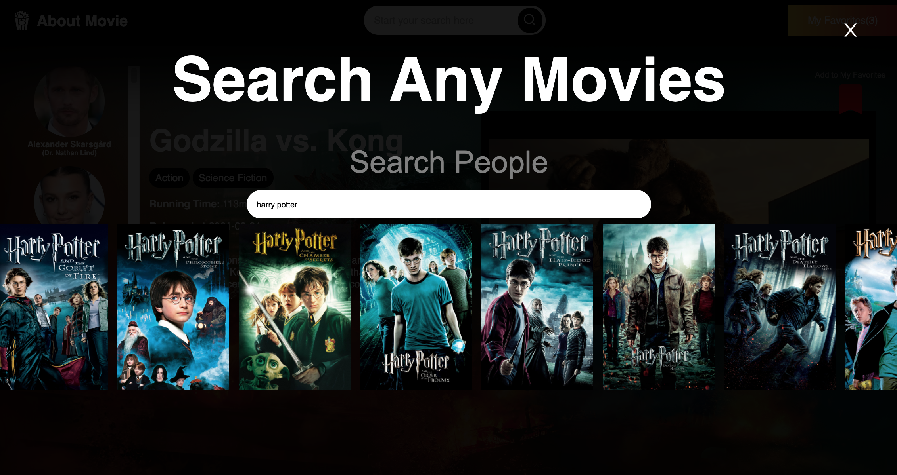
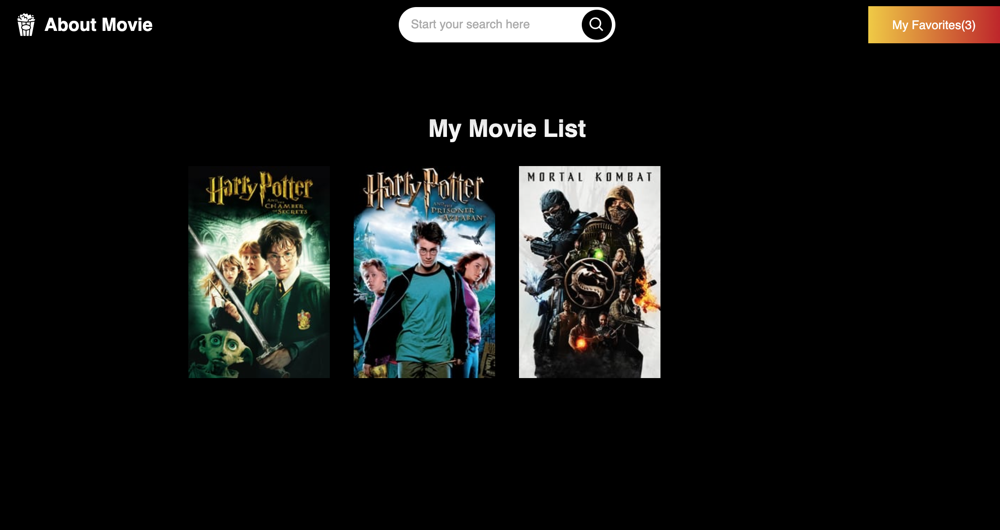
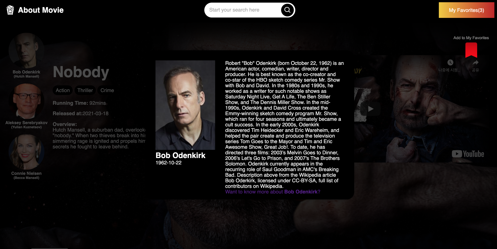
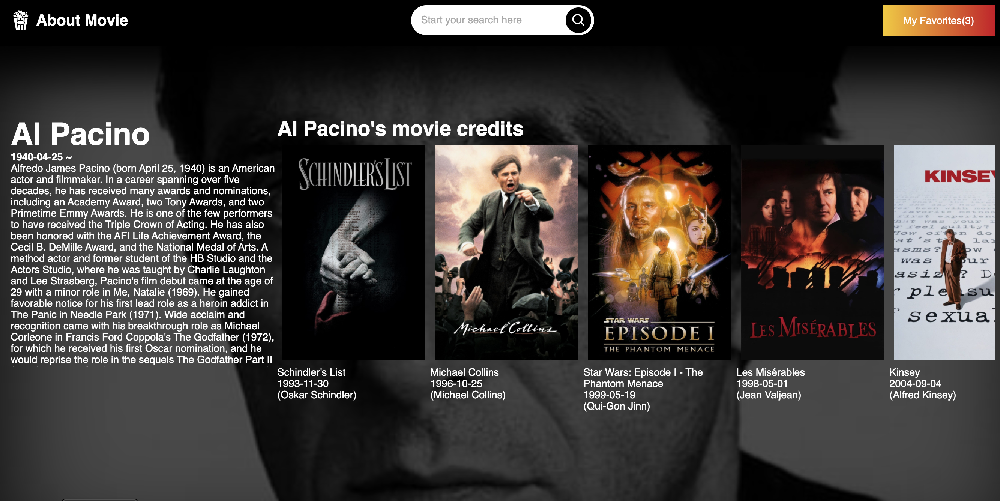

# Movie Search Web App
Simple movie search web app created with React & Redux.


## Table of Contents
1. [General info](#general-info)
2. [Technologies](#technologies)
3. [Setup](#setup)
4. [Features](#features)
5. [Inspiration](#inspiration)
6. [Contact](#contact)

## General info

This is a part of my web development porfolio projects in order to practice Redux and Custom hooks.

Movie Search Web App helps you search any movies or movie casts that you might be curious about while you wathcing movies. For example, let's say you watch Titanic and you don't remeber the names of the casts. Then, this app easily and rapidly help you find the casts of Titanic as well as each casts' movie credits.

## Technologies
Project is create with:

* React 17.0.2
* Redux 4.1.0
* Redux-persist 6.0.0
* Styled-components 5.2.3


## Setup
To run this project, install it locally using the pakage managers either [yarn](https://classic.yarnpkg.com/en/docs/install/#mac-stable) or [npm](https://www.npmjs.com/get-npm)

```
yarn
yarn start

or

npm install
npm start


```
You need an API Key of [TMDB](https://www.themoviedb.org/) to run this project.

## Features
* Get essential and necessay movie and cast information easy and fast.
* Make your own movie list by saving the movie information in your local storage.


## Screenshots
* Movie Search Modal


* Cast Search Modal 


* My movie list


* Movie Detail page


* Cast modal 


* Cast info and credits



## Inspiration
This app is inspired by online movie streaming platforms such as [Netflix](https://www.netflix.com/), [Amazon Prime Video](https://www.primevideo.com) and [Disney+](https://www.disneyplus.com)

## Contact
Email: kimdooinn1@gmail.com /
[Linkedin](https://www.linkedin.com/in/dooinnkim/)


